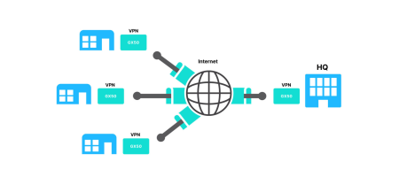

# Multi-Site VPN and VoIP Integration for Real Estate Management Company
This project addressed communication challenges faced by a real estate management company with one main office and five satellite offices. Previously, satellite offices relied on traditional phone lines for interoffice communication, leading to high monthly costs. To overcome this, a new multi-site VPN tunnel was established to allow voice traffic alongside existing data traffic. Additionally, IP phones were deployed at satellite locations, leveraging existing infrastructure and significantly reducing operating costs.

## Environments and Technologies Used

- Item 1
- Item 2
- Item 3

## Operating Systems Used

- Operating System Name

## High-Level Deployment and Configuration Steps

- Step 1
- Step 2
- Step 3
- Step 4
- Step 5

<h2>Architecture Diagram</h2>

